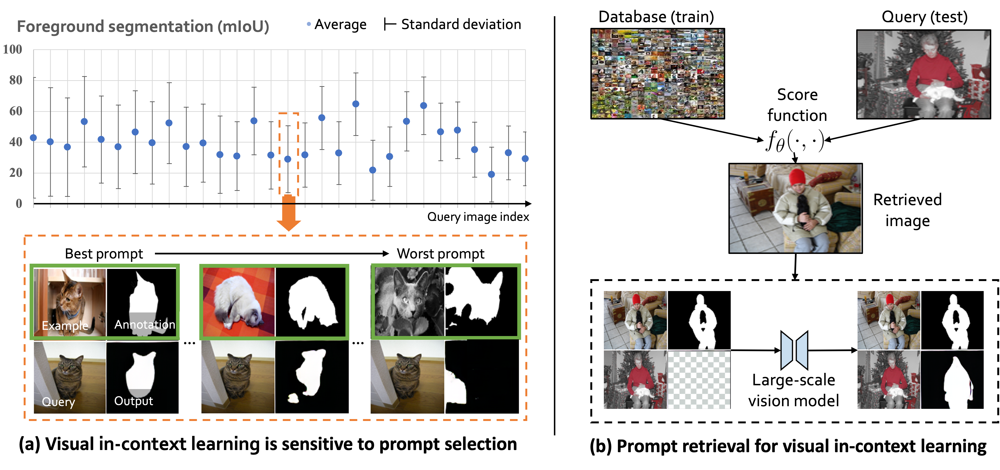

<div align="center">

<h2>What Makes Good Examples for Visual In-Context Learning?</h2>

<div>
    <a href='https://zhangyuanhan-ai.github.io/' target='_blank'>Zhang Yuanhan</a>&emsp;
    <a href='https://kaiyangzhou.github.io/' target='_blank'>Zhou Kaiyang</a>&emsp;
    <a href='https://liuziwei7.github.io/' target='_blank'>Liu Ziwei</a>
</div>
<div>
    S-Lab, Nanyang Technological University
</div>




<h3>TL;DR</h3>
    
We study on the effect of in-context examples in computer vision. We propose a **P**rompt **R**etrieval framework to automatically select examples, consisting of an unsupervised (UnsupPR) and a supervised method (SupPR). 

---

<p align="center">
  <a href="https://arxiv.org/abs/2206.04673" target='_blank'>[arXiv]</a>
</p>

</div>


## Updatas
[01/2023] [arXiv](https://arxiv.org/abs/2206.04673) paper has been **released**.

[01/2023] The code for foureground segmentation has been **released**.

## Environment setup
```
conda create -n XXX python=3.8
conda activate XXX
pip install -r requirements.txt
```

## Data preparation

Our data preparation pipeline is based on [visual prompt](https://github.com/amirbar/visual_prompting). Please follow the dataset preparation steps for PASCAL-5i dataset in this repository.

## How to run
Click the Unsup/Sup stratedgy below to see the detailed instructions on how to run the code to reproduce the results. 

* [Unsupervised Prompt Retrieval](UnsupPR.md)
* [Supervised Prompt Retrieval](SupPR.md)


## Performance
Here, Random is the baseline method in [visual prompt](https://github.com/amirbar/visual_prompting), SupPR and UnsupPR are shorted for supervised prompt retrieval and unsupervised prompt retrieval respectively.


## Model
The SupPR models for each pascal-5<sup>i</sup> split is uploaded in [link](https://entuedu-my.sharepoint.com/:f:/g/personal/yuanhan002_e_ntu_edu_sg/EoUMjMA6FcFFtJPzW9Stm5ABOZvUJ0YyaJvtP9IDI_rk4Q?e=eL62Y6).


## Citation
If you use this code in your research, please kindly cite this work.
```
@inproceedings{zhang2023VisualPromptRetrieval,
      title={What Makes Good Examples for Visual In-Context Learning?}, 
      author={Yuanhan Zhang and Kaiyang Zhou and Ziwei Liu},
      year={2023},
      archivePrefix={arXiv},
}
```

## Acknowledgments
Part of the code is borrowed from [visual prompt](https://github.com/amirbar/visual_prompting), [SupContrast](https://github.com/HobbitLong/SupContrast), [timm](https://github.com/rwightman/pytorch-image-models) and [mmcv](https://github.com/open-mmlab/mmcv).

<div align="center">


</div>

